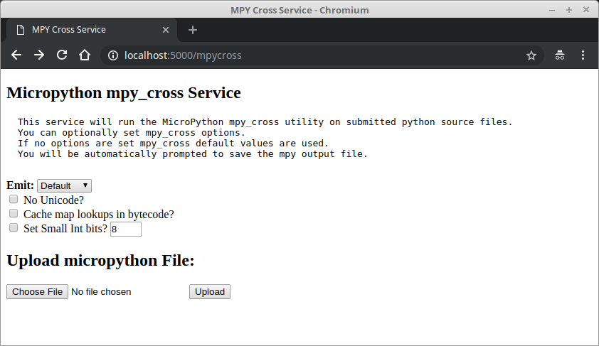

[](https://opensource.org/licenses/Apache-2.0)

## Welcome

Do you want to precompile your micropython modules? This small web service can help. Written in Python using the Flask web development framework this service will allow you process your files with mpy-cross from anywhere using your browser.

<hr>

**Designed for developers, not recommended for production deployment**

<hr>


### Screenshots


### Quick Start

1. Clone the repo

2. Initialize and activate a virtualenv:<br/>
```
  $ python3 -m venv venv  
  $ . venv/bin/activate
```

3. Install the dependencies:<br>
    ```
    $ pip install -r requirements.txt
    ```

5. Run the server:<br>
```
    To run the development server:
    $ export FLASK_APP=main
    $ flask run

    To run using gunicorn (better performance):
    gunicorn -b :5000 main:app
```

6. Navigate to [http://localhost:5000](http://localhost:5000)

### Docker Build Commands
```
To build the docker image:
docker build -t mpyxserv:latest .

To run the image:
docker run --name mpyxserv -d -p 5000:5000 mpyxserv
```

### Useful Docker Commands
```
To view output:
docker logs mpyxserv

To list running containers:
docker ps

To stop the container:
docker stop mpyxserv

To list images:
docker images
```

### Delete Docker images
```
To remove a container:
docker rm mpyxserv

To remove an image:
docker rmi mpyxserv

Prune (remove) unused resources:
docker system prune

```
